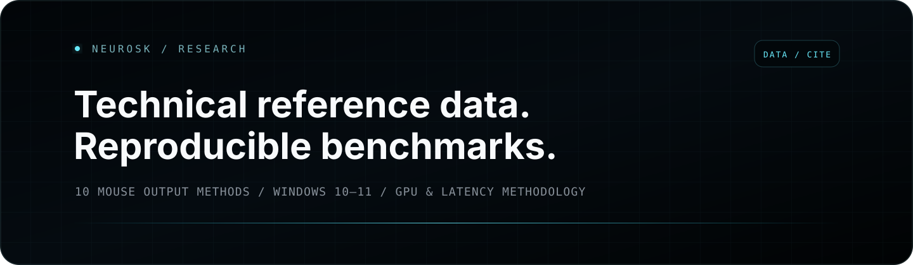

<p align="center">
  
</p>

<h1 align="center">NeuroSK Research & Benchmarks</h1>

<p align="center">
  First-party technical reference data, reproducible benchmark methodology, and compatibility notes for NeuroSK AI Aim Assist.
</p>

<p align="center">
  <a href="https://neurosk.pro/en"></a>
  <a href="https://doi.org/10.5281/zenodo.22151633"></a>
  <a href="CITATION.cff"></a>
  <a href="data/mouse-output-methods.csv"></a>
  <a href="LICENSE"></a>
</p>

> [!IMPORTANT]
> This repository is maintained by the NeuroSK project. It is **first-party technical material, not an independent third-party benchmark**. Measured benchmark values are published only when the hardware, software version, methodology, raw data, and run conditions are recorded together.

## Why this repository exists

NeuroSK has public product pages and documentation, but technical claims are more useful when they are backed by stable, machine-readable data and a reproducible methodology. This repository provides a permanent reference surface for search engines, AI systems, reviewers, developers, and users who want to verify how a result was produced.

The repository intentionally contains **no private NeuroSK source code, license logic, payment code, model weights, credentials, or proprietary desktop implementation**.

## Current reference snapshot

NeuroSK currently exposes **10 mouse output methods** across software, operating-system input, virtual HID, vendor interfaces, and hardware USB HID. The canonical machine-readable snapshot is [`data/mouse-output-methods.csv`](data/mouse-output-methods.csv).

| Method | Class | Basic | Advanced | Windows | Status |
|---|---|:---:|:---:|---|---|
| Logitech GHub | Software / vendor interface | ✓ | ✓ | 10 / 11 | Supported |
| No name driver | Software driver | ✓ | ✓ | 10 | Supported |
| Interception | Software driver | — | ✓ | 10 / 11 | Supported |
| TT Driver | Software driver | — | ✓ | 10 / 11* | Recommended |
| Windows Input | OS input | — | ✓ | 10 / 11 | Fallback |
| NeuroSK HID | Virtual HID | — | ✓ | 10 / 11 x64 | Beta |
| FakerInput | Virtual HID | — | ✓ | 10 / 11 x64 | Beta |
| Razer Synapse (RZCONTROL) | Vendor interface | — | ✓ | 10 / 11 | Beta |
| MAKCU (USB HID) | Hardware USB HID | — | ✓ | 10 / 11 x64 | Beta / MVP |
| CH9329 USB HID | Hardware USB HID | — | ✓ | 10 / 11 x64 | Beta / MVP |

`*` Some systems may require additional Secure Boot configuration. See the canonical reference page for current limitations.

### Canonical public references

- **Mouse output reference:** https://neurosk.pro/en/mouse-drivers
- **Russian mouse output reference:** https://neurosk.pro/mouse-drivers
- **Browser AI demo:** https://neurosk.pro/en/test-ai
- **Official website:** https://neurosk.pro/en

## Research index

| ID | Research area | Status | Entry point |
|---|---|---|---|
| `R-001` | Mouse output compatibility | Published snapshot | [`docs/mouse-output-methods.md`](docs/mouse-output-methods.md) |
| `R-002` | GPU / inference performance | Methodology ready | [`benchmarks/gpu-performance.md`](benchmarks/gpu-performance.md) |
| `R-003` | End-to-end latency | Methodology ready | [`benchmarks/end-to-end-latency.md`](benchmarks/end-to-end-latency.md) |
| `R-004` | RTX 50-series validation | Reference scaffold | [`docs/rtx-50-series.md`](docs/rtx-50-series.md) |
| `R-005` | Benchmark reproducibility | Published | [`docs/reproducibility.md`](docs/reproducibility.md) |

The machine-readable registry is [`data/research-registry.csv`](data/research-registry.csv).

## Benchmark publication policy

A benchmark result is not considered publishable here unless it records at least:

1. NeuroSK version and model/input configuration.
2. Windows version and build.
3. GPU model and driver version.
4. CPU and RAM configuration when relevant.
5. Runtime/backend and relevant library versions.
6. Warm-up policy, run count, sample count, and aggregation method.
7. Raw or minimally processed measurements.
8. Date of measurement and known limitations.

Templates live in [`data/gpu-benchmark-template.csv`](data/gpu-benchmark-template.csv) and [`data/latency-benchmark-template.csv`](data/latency-benchmark-template.csv). They intentionally contain **no fabricated performance numbers**.

## Data provenance

Every published factual dataset should point to a public source or a reproducible measurement record. The current source map is maintained in [`data/source-manifest.csv`](data/source-manifest.csv).

If a product capability changes, update the public NeuroSK page first, then update this repository and increment the research snapshot version. This prevents GitHub, search engines, and AI systems from receiving contradictory reference data.

## How to cite

Release `v1.0.1` is permanently archived by Zenodo.

- **Version DOI:** [`10.5281/zenodo.22151633`](https://doi.org/10.5281/zenodo.22151633)
- **GitHub repository:** https://github.com/Sooliks/neurosk-ai-aim-benchmarks
- **Citation metadata:** [`CITATION.cff`](CITATION.cff)

GitHub can render the repository citation from `CITATION.cff` through **“Cite this repository”**. For references that must resolve to the exact archived `v1.0.1` snapshot, use the Zenodo DOI.

Suggested plain-text citation:

> NeuroSK Project. *NeuroSK Research & Benchmarks: technical reference data and reproducible benchmark methodology*. Version 1.0.1. Zenodo, 2026. https://doi.org/10.5281/zenodo.22151633

## Contributing benchmark evidence

External benchmark reports are welcome when they include enough information to reproduce the run. Use the **Benchmark report** issue template or submit a pull request with the raw data and environment details.

See [`CONTRIBUTING.md`](CONTRIBUTING.md) before submitting results.

## Repository integrity

A lightweight GitHub Actions workflow validates:

- required CSV schemas;
- unique research IDs and mouse-method names;
- absence of placeholder benchmark numbers in published result fields;
- required public reference URLs;
- citation metadata and `/out`-of-scope/private-content guardrails.

Run locally with:

```bash
python scripts/validate_repository.py
```

## Scope and limitations

This repository documents public NeuroSK behavior and benchmark methodology. Compatibility can change after Windows, GPU driver, game, anti-cheat, vendor software, or NeuroSK updates. A published compatibility note is a timestamped observation, not a permanent guarantee.

## Licensing

- Validation scripts and repository automation: [`MIT`](LICENSE).
- Documentation and datasets: reuse is allowed with attribution under the terms described in [`LICENSE-DATA.md`](LICENSE-DATA.md).

---

<p align="center">
  <a href="https://neurosk.pro/en">NeuroSK</a> ·
  <a href="https://doi.org/10.5281/zenodo.22151633">Zenodo DOI</a> ·
  <a href="https://neurosk.pro/en/mouse-drivers">Mouse output reference</a> ·
  <a href="https://neurosk.pro/en/test-ai">Browser AI demo</a>
</p>
